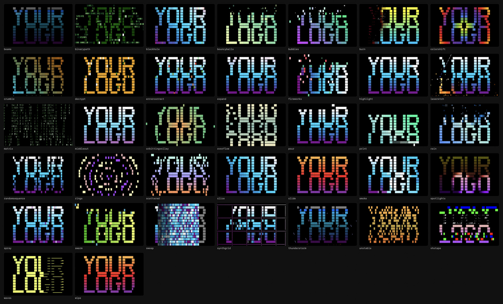
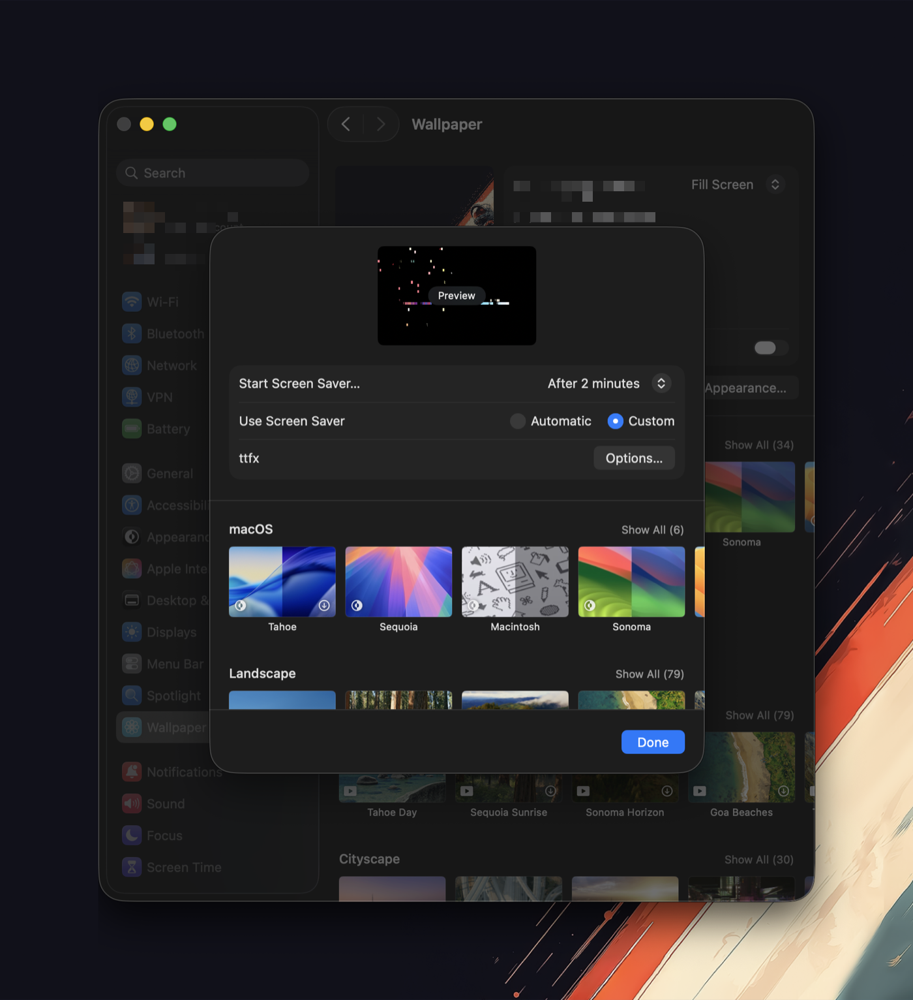
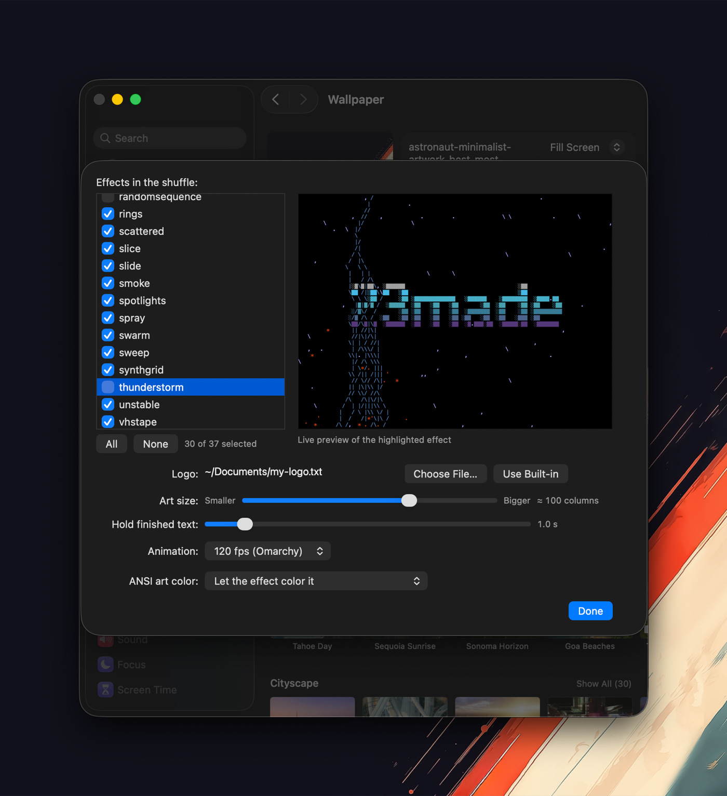

# ttfx-macos-screensaver

Terminal text effects as a macOS screensaver. Your ASCII logo, 37 animated
effects, a random one each cycle.


*That placeholder is just a text file. Point it at your own and it renders the
same way — see [Use your own logo](#use-your-own-logo).*

Built on **[ttfx](https://github.com/omacom-io/ttfx)** by 37signals/omacom-io —
itself a byte-exact Rust port of
**[TerminalTextEffects](https://github.com/ChrisBuilds/terminaltexteffects)**
by ChrisBuilds. Every effect and the entire animation engine are theirs. This
project is the macOS shell around them, modeled on
[Omarchy](https://github.com/basecamp/omarchy)'s screensaver.

**Unofficial** — not affiliated with, endorsed by, or supported by 37signals,
omacom-io, Basecamp, or ChrisBuilds.

## What you get

- **37 effects**, a different one each cycle — or narrow the shuffle to the
  ones you like.
- **Your own logo.** Any plain-text file: FIGlet wordmark, `chafa` conversion
  of an image, or hand-drawn ASCII.
- **ANSI art too.** Color already in the file can be discarded, blended with
  the effect, or preserved exactly.
- **A live preview** in the settings sheet — a real engine session over your
  real logo, so you see the effect before you commit to it.
- **Tuned per display.** The canvas targets a column count rather than a pixel
  size, so the art is the same relative size on a laptop and a 5K panel.
- **Idles at zero.** The view does no work at all while it is off screen, which
  matters more than it should — see [Troubleshooting](#troubleshooting).
- **Signed and notarized**, universal (Apple Silicon and Intel), macOS 11+.



*All 37, each caught somewhere in its animation. Every one of them is
upstream's — see the attribution above.*

## Install

Download the `.pkg` from the
[latest release](https://github.com/HiroProt/ttfx-macos-screensaver/releases/latest)
and double-click it. The installer offers **for all users** or **for me
only**; the second needs no password. Then open Screen Saver settings and
pick **ttfx**.

Signed and notarized, universal binary, macOS 11 and later, Apple Silicon and
Intel.



*There is still no app — macOS's own Screen Saver settings is the whole
interface. Once installed, ttfx appears under **Custom**, and everything
configurable is behind **Options…**.*

Or with Homebrew:

```sh
brew tap HiroProt/tap
brew trust --cask HiroProt/tap/ttfx-screensaver   # Homebrew requires this for third-party taps
brew install --cask ttfx-screensaver
```

<details>
<summary>Why a package, when the bundle is just a folder</summary>

Because a downloaded one is quarantined, and a quarantined screen saver is
not *opened* — it is `dlopen`'d into `legacyScreenSaver`. That goes through a
different Gatekeeper gate than the one an app's first launch goes through,
and when it refuses, what you get is

> "ttfx.saver" Not Opened — Apple could not verify "ttfx.saver" is free of
> malware that may harm your Mac or compromise your privacy.

with **Move to Trash** and **Done** as the only buttons. Correct signing does
not remove that gate; it only makes it usually say yes. It said no to a
correctly signed, notarized, stapled, online-verified copy of this very
screen saver, installed through Homebrew, on macOS 27.

Files an installer lays down carry no `com.apple.quarantine` at all — in
either install domain, measured on a clean VM — so with a package the gate is
never consulted.

The zip is still published for anyone who would rather place the bundle by
hand. If you use it and hit that dialog:

```sh
xattr -dr com.apple.quarantine ~/Library/Screen\ Savers/ttfx.saver
```

</details>

<details>
<summary>Build it yourself instead</summary>

Requires [Rust](https://rustup.rs) and Xcode command line tools
(`xcode-select --install`).

```sh
git clone https://github.com/HiroProt/ttfx-macos-screensaver
cd ttfx-macos-screensaver
./build.sh --install
```

That signs the bundle for your own machine only, which is all you need
locally. `./release.sh --notarize` produces the distributable, Apple-notarized
build.
</details>

## Use your own logo

Open **Options…** in Screen Saver settings, click **Choose File…**, and pick
any plain-text file. That's it — it takes effect on the next cycle.

`examples/logos/` has a few to start from, including the `YourLogo` placeholder
from the demo above. The art should be plain text;
a file wider than the canvas gets clipped, so keep it under about 100
columns unless you also turn the art size down.

### Making good ASCII art

**Text into a big block wordmark.** The fastest route is
[patorjk.com/software/taag](https://patorjk.com/software/taag/) — type your
text, page through hundreds of FIGlet fonts, copy the result. Locally, the
same thing is `brew install figlet` and:

```sh
figlet -f big "hello" > logo.txt
figlet -f banner3 -w 200 "hello" > logo.txt   # chunkier, wider
showfigfonts | less                            # browse installed fonts
```

Fonts made of block characters (`█`, `░`) read better on a screensaver than
fine outline fonts, because each cell becomes a solid tile the effects can
color. The two files in `examples/logos/` are that style.

**An image into ASCII.** [`chafa`](https://hpjansson.org/chafa/) gives the
best results and can restrict itself to characters that suit this use:

```sh
brew install chafa
chafa --format symbols --colors none --symbols block --size 90x30 logo.png > logo.txt
```

`jp2a` (also in Homebrew) is a simpler alternative. Whatever you use, aim for
high contrast — mid-tones turn into visual mush once an effect starts
recoloring everything.

### ANSI art (colored)

Color already in the file is supported. **Options… → ANSI art color** decides
what happens to it:

| Setting | What you get |
|---|---|
| Let the effect color it *(default)* | The art's color is discarded; effects own every color |
| Keep art colors where the effect allows | The art's own palette shows through, effects color the rest |
| Always keep art colors | The art's palette always wins |

So a piece of ANSI art can animate *in* with an effect and settle into its
own true colors. Escape sequences are read as 24-bit and 256-color SGR;
anything else in the file is passed through as text.
`examples/logos/color-ansi.txt` is a small one to try it with.

For authoring, [Moebius](https://blocktronics.github.io/moebius/) is a modern
ANSI editor with a native macOS build, and
[PabloDraw](https://picoe.ca/products/pablodraw/) is the long-standing
cross-platform one. To convert an image straight to colored ANSI, drop the
`--colors none` from the command above:

```sh
chafa --format symbols --colors full --size 90x30 logo.png > logo.txt
```

That output can be used as-is — the cursor and reverse-video sequences chafa
emits are handled. Note it leans on background-color blocks, which look great
but give the effects less to animate than foreground glyphs do. Try both.

## Settings



Everything is behind **Options…**, and applies at the next effect cycle:

- **Effects** — a checklist of all 37, so the shuffle can be any subset. The
  highlighted row plays in a **live preview** beside the list: a real engine
  session over your real logo, scaled down.
- **Logo** — the file picker described above, or the built-in logo.
- **Art size** — the canvas targets ~110 columns at any resolution; the
  slider moves that between 200 (small art) and 50 (huge). Small art on a
  tall display is the expensive corner: the grid targets columns, so rows
  scale with screen height, and past roughly 9,000 cells the engine's memory
  stops being handed back between effects — bounded, but the bound is
  hundreds of megabytes rather than tens. Measured in
  [docs/measurements.md](docs/measurements.md).
- **Hold finished text** — how long the completed logo sits before the next
  effect.
- **Animation** — 30 / 60 / 120 fps. Each tick advances the effect exactly
  one frame, so this is animation *speed* as well as smoothness: 120 plays
  twice as fast as 60 and matches what Omarchy passes tte. Upstream's default
  is 60, which is also the default here. Your display's refresh rate is the
  ceiling.
- **ANSI art color** — as above.

Those knobs are stored as a ByHost preference domain named `gg.ka.ttfx`, but
**not the one `defaults` writes by default.** The screen saver runs inside a
sandboxed host, so its preferences are redirected into that host's container:

```sh
# what the saver actually reads
plutil -p ~/Library/Containers/com.apple.ScreenSaver.Engine.legacyScreenSaver/\
Data/Library/Preferences/ByHost/gg.ka.ttfx.*.plist
```

`defaults -currentHost write gg.ka.ttfx …` writes
`~/Library/Preferences/ByHost/` instead — a file the running saver never opens.
It succeeds, prints nothing, and changes nothing, which makes it a genuinely
expensive way to be wrong. The settings sheet is hosted in the same container
and writes to the right place, so **use Options… to change anything.** The keys
below describe what the sheet stores:

| Key | Meaning |
|---|---|
| `LogoPath` | path to a logo file, re-read each cycle when reachable |
| `LogoText` | logo content snapshot, used when `LogoPath` can't be read |
| `Columns` | target canvas width in cells (40–300, default 110) |
| `FontSize` | exact cell point size; overrides `Columns` |
| `Effects` | array of effect names in the shuffle; unset = all |
| `HoldSeconds` | hold on the finished text, seconds (default 2) |
| `FrameRate` | ticks per second: 15–240, default 60 |
| `ArtColors` | `ignore` (default), `dynamic`, or `always` |

A picked logo is stored as both a path and a content snapshot: the open panel
grants read access at pick time, but the screensaver host's sandbox may not
reach that path later, and the logo must render regardless.

## How it works

A real `ScreenSaverView`, not a terminal in a window. The ttfx engine is
linked in as a static library and pulled for one frame per tick; the Swift
side interprets the ANSI color runs and draws the cell grid with CoreText.
No subprocess — which also sidesteps the sandbox that makes spawning
binaries unreliable inside macOS's screensaver host.

ttfx is consumed as an unmodified dependency pinned to an exact commit. This is
not a fork and vendors no upstream code: everything the bridge needs is
already ttfx's public API, so upstream stays upstream.

```
src/lib.rs                    C API over the ttfx engine (the whole upstream coupling)
Sources/TTFXSaverView.swift   renderer, SGR interpreter, configure sheet
Sources/ttfx.h                the bridge header Swift imports
Resources/                    Info.plist, default logo, picker thumbnails
build.sh                      cargo → swiftc → lipo → codesign, no Xcode project
release.sh                    Developer ID signing, notarization, stapling
examples/                     starter logos and the terminal equivalent
```

## Troubleshooting

**Options… does nothing, or changes don't apply.** macOS caches the loaded
bundle. Quit System Settings with ⌘Q, then
`killall legacyScreenSaver`, and reopen.

**A `legacyScreenSaver` process using CPU when nothing is on screen.** macOS
runs third-party screen savers through an in-process plug-in host that
[Apple's own DTS describes as an outdated model](https://developer.apple.com/forums/thread/797121),
and dismissed instances are not reliably torn down — `stopAnimation` has not
been called dependably since Sonoma. This saver defends against it by doing
no work at all while its view is off screen, so a lingering host costs
nothing: a parked tick is measured at 1/3,300 the cost of a running one, once
a second. If you still see one busy, `killall legacyScreenSaver` is safe.

**System Settings sitting at a few percent CPU** after you closed the Options
sheet: fixed in 0.1.6. The sheet's live preview is a real 60 Hz engine
session, and before that version only the Done button stopped it — closing
System Settings with the sheet still up left it running at ~79% of a core for
as long as the app stayed open. Quitting System Settings ends it.

**"Apple could not verify 'ttfx.saver' is free of malware"**, or "ttfx.saver
is damaged", with only **Move to Trash** and **Done** to choose from. The
bundle is quarantined and Gatekeeper's library-load gate refused it. Clear
the flag:

```sh
xattr -dr com.apple.quarantine ~/Library/Screen\ Savers/ttfx.saver
```

Then install the `.pkg` rather than the zip, which is the version of this
that cannot happen — see [Install](#install). A bundle from `./build.sh` is
ad-hoc signed for the machine that built it, and needs the same line after
being zipped and moved to another Mac.

## Uninstall

```sh
brew uninstall --cask ttfx-screensaver      # if you installed it that way
```

Or by hand, depending on where the installer put it:

```sh
sudo rm -rf /Library/Screen\ Savers/ttfx.saver   # "for all users"
rm -rf ~/Library/Screen\ Savers/ttfx.saver       # "for me only", or the zip
sudo pkgutil --forget gg.ka.ttfx
rm -f ~/Library/Containers/com.apple.ScreenSaver.Engine.legacyScreenSaver/\
Data/Library/Preferences/ByHost/gg.ka.ttfx.*.plist
```

The second line is the preferences, in the sandbox container described under
[Settings](#settings). Leaving it costs nothing but a few hundred bytes.

## License

MIT — see [LICENSE](LICENSE), which carries this project's copyright
alongside ttfx's and TerminalTextEffects', and [NOTICE](NOTICE) for the
attribution chain in full. The engine is statically linked into the built
bundle, so both upstream copyrights travel with any binary produced here.

By [Martin May](https://github.com/HiroProt) / [23made](https://23made.com).
