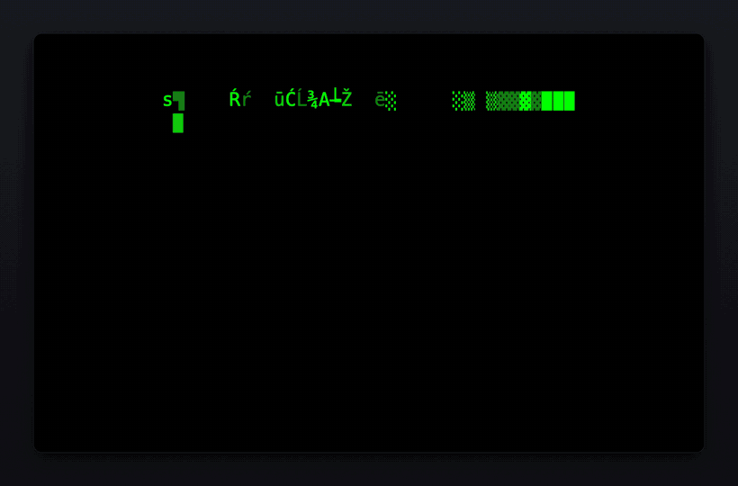

# ttfx-macos-screensaver

Terminal text effects as a macOS screensaver. Your ASCII logo, 37 animated
effects, a random one each cycle.



Built on **[ttfx](https://github.com/omacom-io/ttfx)** by 37signals/omacom-io —
itself a byte-exact Rust port of
**[TerminalTextEffects](https://github.com/ChrisBuilds/terminaltexteffects)**
by ChrisBuilds. Every effect and the entire animation engine are theirs. This
project is the macOS shell around them, modeled on
[Omarchy](https://github.com/basecamp/omarchy)'s screensaver.

**Unofficial** — not affiliated with, endorsed by, or supported by 37signals,
omacom-io, Basecamp, or ChrisBuilds.

## What it actually is

A real `ScreenSaverView`, not a terminal in a window. The ttfx engine is
linked in as a static library and pulled for one frame per tick; the Swift
side interprets the ANSI color runs and draws the cell grid with CoreText.
No subprocess — which also sidesteps the sandbox that makes spawning
binaries unreliable inside macOS's screensaver host.

ttfx is consumed as an unmodified dependency pinned to a release tag. This is
not a fork and vendors no upstream code: everything the bridge needs is
already ttfx's public API, so upstream stays upstream.

## Install

Requires [Rust](https://rustup.rs) and Xcode command line tools.

```sh
git clone https://github.com/HiroProt/ttfx-macos-screensaver
cd ttfx-macos-screensaver
./build.sh --install
```

Then System Settings → Screen Saver → **ttfx** (under "Other").

There are no prebuilt downloads. A `.saver` from the internet is ad-hoc
signed and Gatekeeper blocks it with no clean override path for screensavers;
distributing binaries properly needs a paid Developer ID identity and
notarization. Building locally signs it for your own machine and takes about
a minute.

## Settings

Everything is behind **Options…**, and applies at the next effect cycle:

- **Effects** — a checklist of all 37, so the shuffle can be any subset. The
  highlighted row plays in a **live preview** beside the list: a real engine
  session over your real logo, scaled down.
- **Logo** — pick any plain-text ASCII art file. `examples/logos/` has a
  couple to start from. Color codes in the file are ignored; the effects
  supply all color.
- **Art size** — the canvas targets ~110 columns at any resolution; the
  slider moves that between 200 (small art) and 50 (huge).
- **Hold finished text** — how long the completed logo sits before the next
  effect.
- **Animation** — 30 / 60 / 120 fps. Each tick advances the effect exactly
  one frame, so this is animation *speed* as well as smoothness: 120 plays
  twice as fast as 60 and matches what Omarchy passes tte. Upstream's default
  is 60, which is also the default here. Your display's refresh rate is the
  ceiling.

The same knobs are scriptable — the sheet and the saver share one defaults
domain:

```sh
defaults -currentHost write gg.ka.ttfx Columns -float 70
defaults -currentHost write gg.ka.ttfx FrameRate -int 120
defaults -currentHost write gg.ka.ttfx Effects -array matrix rain waves
defaults -currentHost delete gg.ka.ttfx Effects        # back to all 37
```

| Key | Meaning |
|---|---|
| `LogoPath` | path to a logo file, re-read each cycle when reachable |
| `LogoText` | logo content snapshot, used when `LogoPath` can't be read |
| `Columns` | target canvas width in cells (40–300, default 110) |
| `FontSize` | exact cell point size; overrides `Columns` |
| `Effects` | array of effect names in the shuffle; unset = all |
| `HoldSeconds` | hold on the finished text, seconds (default 2) |
| `FrameRate` | ticks per second: 15–240, default 60 |

A picked logo is stored as both a path and a content snapshot: the open panel
grants read access at pick time, but the screensaver host's sandbox may not
reach that path later, and the logo must render regardless.

## Layout

```
src/lib.rs               C API over the ttfx engine (the whole upstream coupling)
Sources/TTFXSaverView.swift   renderer, SGR interpreter, configure sheet
Sources/ttfx.h           the bridge header Swift imports
Resources/               Info.plist + the default logo
build.sh                 cargo → swiftc → lipo → codesign, no Xcode project
```

Universal (arm64 + x86_64), deployment target macOS 11.

## Uninstall

```sh
rm -rf ~/Library/Screen\ Savers/ttfx.saver
defaults -currentHost delete gg.ka.ttfx
```

## License

MIT — see [LICENSE](LICENSE), which carries this project's copyright
alongside ttfx's and TerminalTextEffects', and [NOTICE](NOTICE) for the
attribution chain in full. The engine is statically linked into the built
bundle, so both upstream copyrights travel with any binary produced here.

By [Martin May](https://github.com/HiroProt) / [23made](https://23made.com).
